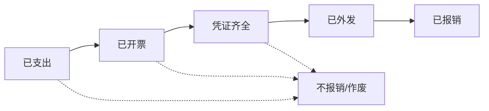
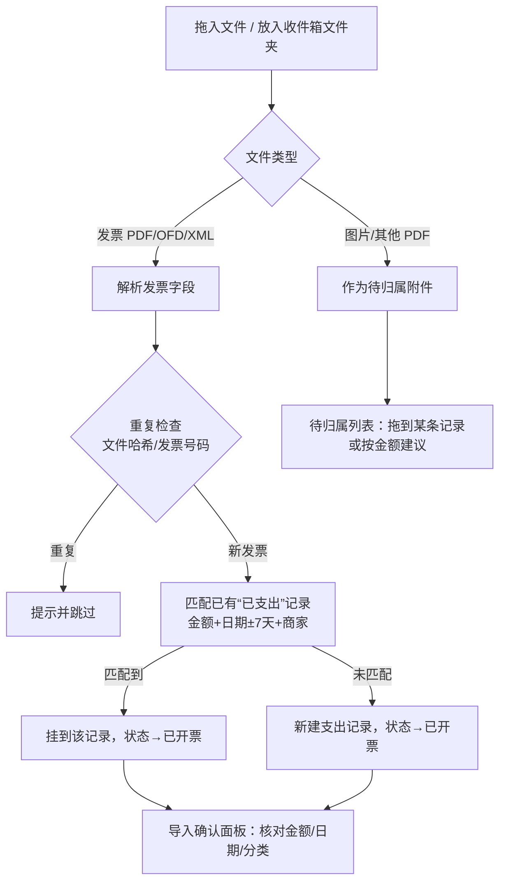
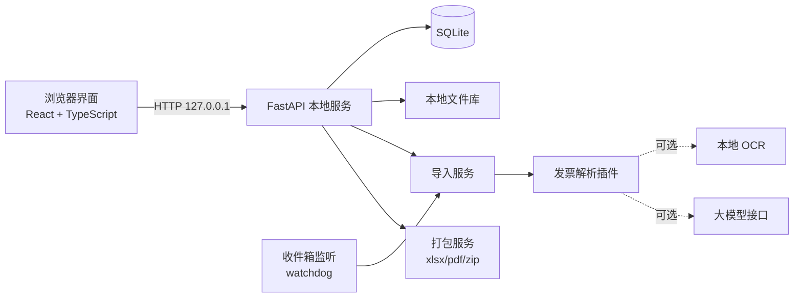
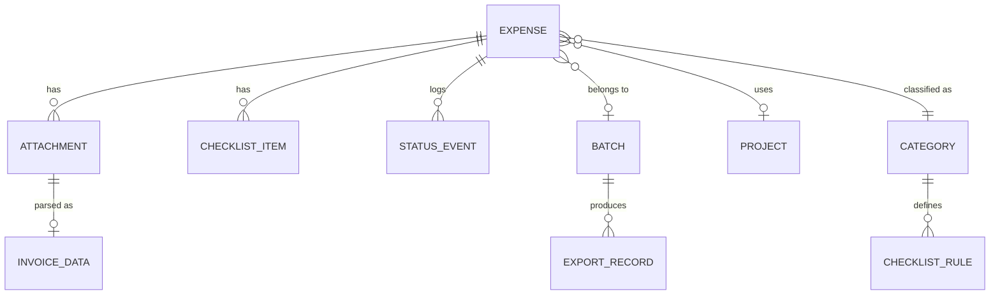

# 个人发票报销管理工具 · 开发蓝图

版本：v2.0（基于《智能发票报销管理平台应用方案与开发蓝图 v1.0》精简重构）
编制日期：2026年9月17日
仓库：https://github.com/lsgoodlionel/Invoice-sorting
适用阶段：个人使用，单用户、本机运行

---

## 0 相对 v1.0 的调整结论

v1.0 面向“学校级多角色报销审查平台”，包含权限体系、版本化规则引擎、审查工作台、借款核销、外部接口等。当前阶段只给**一个人管理自己的发票与报销过程**，因此按“能少则少”的原则重构：

| 维度 | v1.0 | v2.0（本蓝图） | 理由 |
| --- | --- | --- | --- |
| 用户 | 7 类角色、组织/项目授权 | 单用户，无登录 | 本机个人工具，权限无意义 |
| 核心对象 | 发票、业务事项、报销单、材料包 4 个 | **支出记录**、**报销批次** 2 个 | 个人场景“一次支出”即一个事项 |
| 状态 | 6 组并行状态机 | **一条主状态线 5 步** + 作废 | 一眼看懂进度 |
| 规则 | 版本化规则引擎、冲突登记、四眼复核 | **凭证清单模板 + 提醒**（可编辑） | 只提醒不裁决，最终由财务审核 |
| 识别 | 全票种 OCR、坐标证据、置信度 | 电子发票 PDF/XML 文本解析为主，OCR 可选 | 个人票据以数电票为主，解析准确且快 |
| 审查 | 审查工作台、核减、职责分离 | 删除 | 审查发生在学校财务侧 |
| 导出 | 审查包 / 正式准备包 + 快照 | **一键打包**：汇总表 + 分类文件夹 + 合并打印 PDF | 聚焦“外送资料” |
| 统计 | 6 种金额口径 × 5 种日期口径 | 按周期 × 分类 × 状态的汇总，日期口径可切换 | 个人对账够用 |
| 借款、差旅计算、会议定额、外部接口 | 规划实现 | 暂不做，保留为提醒文本 | YAGNI |
| 部署 | 服务端 + 对象存储 + 队列 | 本机单进程 + SQLite + 本地文件夹 | 零运维，数据在自己手里 |

**保留的 v1.0 精华**：金额用“分”整数存储不用浮点；原始文件不修改；识别结果需人工确认关键字段；重复发票检测；S2/S3 的分类与凭证要求作为内置提醒；导出资料按类别分组。

---

## 1 产品定位

> 把“收发票、找截图、凑凭证、记进度、打包外送”这件事，变成“拖进来 → 点一下 → 打个包”。

### 1.1 目标

1. **收集省事**：发票、订单截图、支付记录拖入即归档；自动读出金额、日期、销售方、项目名称。
2. **进度清楚**：每笔支出处于哪一步（已支出 / 已开票 / 凭证齐全 / 已外发 / 已报销），一个列表看全。
3. **少整理**：文件自动按“年/月/支出”重命名归档；凭证缺什么由清单模板提示。
4. **按阶段查看**：按月、季度、年度或自定义区间，按分类与状态查看金额汇总。
5. **一键外送**：勾选若干支出生成一个报销批次，输出分类整理好的 ZIP（含汇总 Excel 与合并打印 PDF）。

### 1.2 非目标（当前阶段不做）

- 多用户、登录、权限、协作审批。
- 代替学校财务做合规裁决；自动计算差旅/会议/培训定额。
- 发票真伪查验、与学校财务系统或资产平台对接。
- 借款管理、预算余额核验。
- 手机 App（手机端可通过局域网浏览器补传照片，列为后续可选）。

### 1.3 使用原则

- **提醒不拦截**：系统只提示“可能还缺什么”，用户可随时标记“不需要”并继续。
- **不编造**：识别不出的字段留空待填，不猜测；说明文字模板只做填空。
- **本地优先**：默认不把任何票据发送到外部服务；AI/云 OCR 为可选开关。

---

## 2 核心概念

只有两个业务对象，外加少量配置。

### 2.1 支出记录（Expense）

一次花钱的事，例如“9月15日 京东 买鼠标2个 960元”。它包含：

- 基本信息：日期、金额、商家、摘要、分类、经费项目（可选）、付款方式、备注。
- 附件：发票（1~N 张）、订单/明细、支付记录、验收单、合同、情况说明、其他。
- 凭证清单：由分类决定需要哪些附件，逐项打勾。
- 状态：见第 3 节。

> 一张发票对应多笔支出、或一笔支出拆到多个经费项目的情况，个人场景少见。v2.0 不做金额拆分；如确需拆分，在备注说明，或复制为两条记录分别填写金额。

### 2.2 报销批次（Batch）

一次外送给财务/经办人的资料集合，例如“2026-09 科研项目A 第1批”。它包含：

- 名称、经费项目、创建日期、外发日期、外发方式（邮件/当面/寄送）、接收人、外部单号（预约单号等）。
- 若干支出记录。
- 导出记录：每次打包的时间与文件位置。
- 回款信息：到账日期、到账金额（可部分）、核减说明。

### 2.3 配置项

| 配置 | 内容 | 默认值 |
| --- | --- | --- |
| 分类 | 名称、图标颜色、默认凭证清单、关键词 | 见 4.1 |
| 凭证清单模板 | 附件类型列表 + 触发条件（如金额≥1000） | 见 4.2 |
| 经费项目 | 经费号、名称、负责人、是否启用 | 空，用户自建 |
| 数据目录 | 数据库与文件库位置 | `~/InvoiceSorting/` |
| 购方抬头校验 | 期望的购方名称/税号 | 用户首次设置 |

---

## 3 状态设计（一条主线）



| 状态 | 含义 | 自动进入条件 | 可手动 |
| --- | --- | --- | --- |
| 已支出 | 钱花了，发票还没到 | 新建记录且无发票附件 | ✔ |
| 已开票 | 发票已收到并确认 | 至少 1 张发票附件且关键字段已确认 | ✔ |
| 凭证齐全 | 需要的材料都有了 | 凭证清单中必需项全部“已有”或“不需要” | ✔ |
| 已外发 | 已交给财务/经办人 | 所属批次标记为“已外发” | ✔ |
| 已报销 | 钱已到账 | 所属批次登记到账（全额或该记录勾选到账） | ✔ |
| 不报销/作废 | 个人承担、重复、退货等 | 仅手动，需填原因 | ✔ |

规则：

1. 状态**自动推进、允许手动覆盖**；手动设置的状态显示小图标“手动”，条件变化时不会被自动回退，但会提示“凭证清单又出现缺项”。
2. 状态只前进一格一格显示，但允许跳过（例如收到发票时附件已全部齐备，直接到“凭证齐全”）。
3. 每次状态变化写入时间线（时间、从→到、自动/手动、备注），用于回看报销过程。
4. 从批次移出记录时，状态回到“凭证齐全”（或按清单重新计算）。
5. “已外发”超过 N 天（默认 30 天，可设置）未到账，在首页提醒。

---

## 4 分类与凭证清单

### 4.1 默认分类

基于 v1.0 S2（易耗品分类附件）与 S3（报销要点速查）归并为个人常用的 10 类，可增删改：

| 分类 | 典型内容 | 自动识别关键词示例 |
| --- | --- | --- |
| 办公用品 | 文件夹、笔、本子、打印纸、硒鼓以外的文具 | 文件夹、签字笔、便利贴、打印纸、复印纸 |
| 易耗品 | 键鼠、内存、U盘外的电脑配件、电池、网线、实验手套、硒鼓 | 鼠标、键盘、硒鼓、电池、网线、手套 |
| 低值品 | 移动硬盘、U盘、录音笔、低值工具 | 移动硬盘、U盘、优盘、录音笔 |
| 设备 | 单价≥1000 元的仪器设备、电脑 | 笔记本电脑、显示器、打印机 |
| 材料 | 试剂、实验材料、专业耗材 | 试剂、耗材、材料 |
| 软件服务 | 网盘、会议、问卷、订阅 | 会员、网盘、腾讯会议、问卷星、订阅 |
| 印刷快递 | 打印、复印、快递邮寄 | 印刷、打印费、快递、邮政 |
| 差旅交通 | 火车、机票、住宿、打车 | 铁路、客票、航空、住宿、出行 |
| 餐饮会议 | 工作餐、会议费 | 餐饮、会议费、餐费 |
| 其他 | 无法归类 | — |

分类建议优先级：① 同一销售方上次用的分类 → ② 发票“项目名称”中的税收分类简称（如 `*计算机配套产品*`） → ③ 关键词表 → ④ 其他。建议结果需用户确认（导入时一键确认）。

### 4.2 凭证清单模板

每个分类有一份模板；每项有“必需 / 建议”两个级别与可选的触发条件。以下默认值来自 v1.0 第 7 节 P01–P08，**仅作提醒，以学校现行口径为准**，用户可编辑。

| 分类 | 必需 | 条件触发 | 提醒文字 |
| --- | --- | --- | --- |
| 通用（所有分类继承） | 发票 | 金额 ≥ 1000 → 支付记录（必需） | 单张发票≥1000元需附支付记录；同一商家累计也需注意 |
| 办公用品 | — | 网购 → 订单明细（必需）；金额 ≥ 500 → 明细清单（必需） | 办公用品不走设备与实验室平台 |
| 易耗品 / 低值品 / 材料 | 订单明细、验收单 | — | 设备与实验室平台 → 材料易耗品低值品报账 → 审批后打印验收单；金额填“材料费” |
| 设备 | 申购单、验收单、支付记录 | 金额 ≥ 30000 → 合同 | 单价≥1000元需先申购，申购日期应早于购买日期 |
| 软件服务 | 订单、软件服务报账单、验收单 | — | 金额填“委托其他业务费” |
| 差旅交通 | 行程单 | 打车 → 行程单（必需） | 需与出差单对应；个人行程及节假日不报 |
| 餐饮会议 | 工作餐单 或 会议材料（通知/议程/签到表/预决算表） | — | 工作餐 50 元/人/餐；会议按类型定额 |
| 任意 | — | 金额 ≥ 30000 → 合同 | 合同需职能部门盖章，不得倒签 |

清单项状态：`缺少` / `已有`（关联了对应类型附件时自动勾选）/ `不需要`（手动，可填原因）。

### 4.3 办理路径与说明模板（辅助）

- 每个分类可附一段“办理路径”文本（如易耗品报账路径），在详情页折叠显示，可一键复制。
- 情况说明模板：填空式（事由、日期、金额、用途），生成 DOCX/PDF 附件，签字留白，不生成签名或印章。

---

## 5 关键流程

### 5.1 收集：拖进来就完成 80%



要点：

1. **两种入口**：页面拖放；监听“收件箱文件夹”（默认 `~/InvoiceSorting/收件箱/`，可把邮箱下载目录或网盘同步目录设为收件箱）。
2. **批量导入确认面板**：导入完成后一次性展示一张表（文件缩略图、金额、日期、销售方、建议分类），逐行可改，全部无误点“全部确认”。这是整个流程唯一必须的人工步骤。
3. **先记账后补票**：支付后可手动快速新建“已支出”记录（仅需金额、商家、分类三项），发票到了自动匹配挂上。
4. **附件自动归属**：截图等非发票文件进入“待归属”；若用户在记录详情页拖入，则直接挂到该记录并按文件名/内容建议附件类型（如文件名含“订单”→订单明细，含“支付”“账单”→支付记录）。
5. **购方抬头校验**：解析出的购买方名称/税号与设置不一致时标黄提示。

### 5.2 跟进：列表即看板

主列表默认按状态分组，显示每组数量与金额；每行显示“缺 N 项”标记，点击展开缺项，直接拖入文件补齐。

### 5.3 外送：批次打包


- 加入批次时若记录仍有必需项缺失，弹出提醒（可“仍然加入”）。
- 默认同一批次限定一个经费项目（可关闭），避免混项目打包。
- 打包可重复进行，每次生成新文件，不覆盖旧包。

### 5.4 回顾：按阶段查看

统计页选择周期（本月/本季度/本年/自定义）与日期口径，查看分类 × 状态汇总，点任意数字钻取到记录列表。

---

## 6 界面设计

### 6.1 设计原则

- **三个主页面**：`收集`、`清单`、`批次`，外加 `统计` 与 `设置`。侧边栏 5 个入口，不再多。
- **每屏一个主按钮**：收集页“全部确认”，清单页“加入批次”，批次页“打包”。
- **详情用侧边抽屉**，不跳页，关闭即回原位置。
- 金额右对齐、两位小数、千分位；状态用“文字 + 颜色点”，不单靠颜色。
- 常用快捷键：`N` 新建支出、`/` 搜索、`B` 加入批次、`Esc` 关闭抽屉、`1–5` 快速设置状态。
- 桌面浏览器优先，最小宽度 1024px；窄屏降级为单列。

### 6.2 页面线框

**① 收集页**

```text
┌──────────────────────────────────────────────────────────────┐
│  将发票、订单截图、支付记录拖到这里  （或放入 收件箱 文件夹）   │
│                     [ 选择文件 ]                               │
├──────────────────────────────────────────────────────────────┤
│ 本次导入 6 个文件：4 张发票 · 2 个附件 · 1 个重复已跳过         │
│ ┌────┬──────────┬───────────┬─────────┬─────────┬──────────┐ │
│ │预览│ 开票日期 │ 销售方     │ 金额    │ 分类    │ 匹配      │ │
│ │ ▣  │ 09-15    │ 京东××店   │ 960.00  │ 易耗品▾ │ 新建      │ │
│ │ ▣  │ 09-12    │ 腾讯云     │ 298.00  │ 软件服务▾│ 挂到已支出│ │
│ └────┴──────────┴───────────┴─────────┴─────────┴──────────┘ │
│ 待归属附件 2：订单截图.png  支付记录.jpg  → 拖到上方行          │
│                                          [ 全部确认 ]          │
└──────────────────────────────────────────────────────────────┘
```

**② 清单页（主工作区）**

```text
┌ 筛选：[2026年第三季度▾] [全部分类▾] [全部项目▾]  搜索[      ] [+ 新建] ┐
│ 已支出 2 · ¥1,280.00 │ 已开票 5 │ 凭证齐全 3 │ 已外发 4 │ 已报销 12     │
├────────────────────────────────────────────────────────────────────────┤
│ ☐ 09-15 京东××店  鼠标×2        易耗品   960.00  ● 已开票   缺 2 项    │
│ ☐ 09-12 腾讯云    会议会员       软件服务 298.00  ● 凭证齐全           │
│ ☐ 09-03 滴滴出行  市内交通       差旅交通  46.50  ● 已外发  批次#3     │
├────────────────────────────────────────────────────────────────────────┤
│ 已选 2 条 · ¥1,258.00                        [ 加入批次 ] [ 设置状态 ] │
└────────────────────────────────────────────────────────────────────────┘
```

**③ 支出详情抽屉**

```text
┌ 京东××店 · 鼠标×2 ─────────────────────── ¥960.00 ┐
│ ● 已支出 ─ ● 已开票 ─ ○ 凭证齐全 ─ ○ 已外发 ─ ○ 已报销 │
│ 日期 2026-09-15  分类 易耗品▾  项目 科研A▾  付款 微信▾ │
│ ── 凭证清单 ───────────────────────────────────── │
│ ✔ 发票               发票_24312000000012345678.pdf │
│ ✘ 订单明细            [拖入或选择]   [不需要]       │
│ ✘ 验收单              [拖入或选择]   [不需要]       │
│ ▸ 办理路径（点击展开，可复制）                      │
│ ── 附件预览 ── [PDF 预览区]                         │
│ ── 备注 ──  [                          ]           │
│ ── 时间线 ── 09-15 创建 · 09-16 已开票（自动）       │
└────────────────────────────────────────────────────┘
```

**④ 批次页**

```text
┌ 批次 #4  2026-09 科研A 第1批      状态：待外发          ┐
│ 共 8 条 · ¥5,432.10   ⚠ 1 条缺少支付记录                │
│ 打包结构：(•) 按支出分组  ( ) 按材料类型分组             │
│ [ 生成资料包 ]  [ 标记已外发 ]  [ 登记到账 ]             │
│ 历史打包：09-17 14:02  报销资料_科研A_20260917.zip  打开 │
└─────────────────────────────────────────────────────────┘
```

**⑤ 统计页**

- 顶部：周期选择 + 日期口径（支出日期 / 开票日期 / 外发日期 / 到账日期，默认支出日期）。
- 四个数字：本期支出总额、已报销、在途（已外发未到账）、待处理（未外发）。
- 分类 × 状态交叉表；按月趋势柱状图（一种图即可）。
- 支持“导出为 Excel”。

---

## 7 发票识别

### 7.1 支持范围

| 优先级 | 类型 | 方式 |
| --- | --- | --- |
| P1 | 数电发票（全电）PDF、增值税电子普通/专用发票 PDF | PDF 文本层解析 + 版式正则 |
| P1 | 数电发票 XML | 结构化解析（最准确，同时导入时优先用 XML） |
| P2 | 铁路电子客票、航空电子行程单 PDF | 专用模板 |
| P2 | OFD 版式发票 | OFD 解压读取 XML 内容 |
| P3 | 扫描件/照片发票、支付截图金额 | 本地 OCR（可选安装，如 RapidOCR / PaddleOCR） |
| — | 无法识别 | 作为附件导入，手工填写金额、日期 |

### 7.2 提取字段（精简）

必取：发票号码、开票日期、价税合计、销售方名称、购买方名称。
尽量取：销售方税号、购买方税号、项目名称（首行 + 行数）、税额、不含税金额、票种。
差旅票：乘车/乘机日期、出发地、到达地、乘客姓名。

### 7.3 处理规则

1. 原始文件复制到文件库后**只读保存**，不修改；计算 SHA-256。
2. 重复判定：文件哈希相同 → 直接判重；发票号码相同 → 判重并提示已在哪条记录。
3. 价税合计的大小写/合计校验不一致 → 标黄待确认。
4. 金额以“分”为整数存储（`amount_cents`），显示时格式化。
5. 解析器按票种插件化（`parsers/` 下一个文件一种），便于新增版式；每个解析器配真实匿名样本单测。
6. 可选“AI 辅助识别”开关（默认关）：仅在规则解析失败时，把**文本内容**（非原图）发送给用户配置的大模型接口补全字段，结果同样需确认。

---

## 8 文件归档与资料包

### 8.1 文件库结构（不打开应用也能看懂）

```text
~/InvoiceSorting/
├── invoice.db                       # SQLite 数据库
├── 收件箱/                          # 监听目录，处理后移走
├── 文件库/
│   └── 2026/
│       └── 09/
│           └── 20260915_京东××店_易耗品_960.00_E0123/
│               ├── 发票_24312000000012345678.pdf
│               ├── 订单明细_1.png
│               └── 支付记录_1.jpg
├── 资料包/
│   └── 20260917_科研A_第1批/
│       └── 报销资料_科研A_20260917_1402.zip
└── 备份/
```

- 支出记录的文件夹名在修改日期/商家/金额后**自动重命名**（数据库存相对路径 + 记录 ID，改名不断链）。
- 附件命名：`{附件类型}_{序号或发票号}.{扩展名}`。
- 删除记录时文件移入 `文件库/.回收站/`，30 天后可清理（需用户手动确认）。

### 8.2 资料包内容

```text
报销资料_科研A_20260917_1402.zip
├── 00_报销汇总表.xlsx          # 序号、日期、商家、摘要、分类、金额、发票号、附件清单、缺项
├── 01_打印版_全部材料.pdf       # 按汇总表顺序合并：发票→订单→支付记录→验收单…（图片转 PDF 页）
├── 02_发票原件/                # 原始电子发票 PDF/OFD/XML，不做修改
│   └── 01_960.00_京东××店_24312000000012345678.pdf
└── 03_支撑材料/
    ├── 01_京东××店_960.00/     # 按支出分组（默认）
    │   ├── 订单明细_1.png
    │   └── 支付记录_1.jpg
    └── ...
```

- 可选“按材料类型分组”：`03_支撑材料/订单明细/`、`/支付记录/`、`/验收单/`…
- 汇总表末行合计金额；按分类小计一张 sheet（便于填“材料费”“委托其他业务费”等栏目）。
- 序号贯穿汇总表、打印 PDF、文件名前缀，方便财务对照。
- 原始电子发票单独存放，合并 PDF 仅作为打印阅读副本。

---

## 9 统计

| 指标 | 定义 |
| --- | --- |
| 支出总额 | 所选周期内、非作废记录金额合计 |
| 已开票未外发 | 状态为已开票/凭证齐全的金额 |
| 在途 | 状态为已外发的金额 |
| 已报销 | 登记到账的金额（部分到账按实际到账额） |
| 个人承担 | 状态为“不报销”的金额（单列，不计入上面各项） |

- 周期：自然月、自然季度、自然年、自定义起止（含起止日）。时区 Asia/Shanghai。
- 日期口径可切换；切换后页面标题显示“按××日期统计”，避免误读。
- 维度：分类、经费项目、商家、状态。
- 所有数字可点击钻取到记录列表；统计与列表使用同一查询函数，保证一致。

---

## 10 技术方案

### 10.1 架构



单进程应用：启动后在 `127.0.0.1:8765` 提供 API 与前端静态文件，并自动打开浏览器。不需要数据库服务、消息队列或容器。

### 10.2 技术选型

| 层 | 选型 | 说明 |
| --- | --- | --- |
| 后端 | Python 3.12 + FastAPI + SQLAlchemy 2 + Pydantic 2 | Python 发票/PDF 生态完善 |
| 数据库 | SQLite（WAL 模式）+ Alembic 迁移 | 单文件，易备份 |
| PDF 解析 | pdfplumber（文本与坐标）、pypdf（合并） | 许可证友好（MIT/BSD） |
| 图片转 PDF / 缩略图 | Pillow、pypdfium2 | 缩略图渲染 |
| Excel | openpyxl | 汇总表 |
| 文件监听 | watchdog | 收件箱 |
| OCR（可选） | RapidOCR（onnxruntime） | 本地运行，按需安装 extras |
| 前端 | React 18 + TypeScript + Vite | |
| UI 组件 | Mantine（表格、抽屉、拖放、日期选择开箱即用） | 自定义主题避免模板感 |
| 数据请求 | TanStack Query | |
| 包管理 | uv（后端）、pnpm（前端） | |
| 测试 | pytest + pytest-cov；Vitest；Playwright（关键流程 E2E） | 覆盖率目标 80% |
| 打包分发 | `uv run invoice-sorting` 启动；后续可选 PyInstaller 打成 macOS App | |

> 选型为建议，开工前按当前版本核对维护状态与许可证后在 `docs/adr/` 记录决定。

### 10.3 工程目录

```text
Invoice-sorting/
├── backend/
│   ├── pyproject.toml
│   ├── src/invoice_sorting/
│   │   ├── main.py              # 启动、静态文件、打开浏览器
│   │   ├── config.py            # 数据目录、端口、开关
│   │   ├── db/                  # 模型、会话、迁移
│   │   ├── expenses/            # 支出记录：API、服务、状态推进
│   │   ├── attachments/         # 文件入库、哈希、重命名、预览
│   │   ├── importer/            # 拖放/收件箱导入、匹配、去重
│   │   ├── parsers/             # 发票解析插件（digital_pdf.py, xml.py, rail.py…）
│   │   ├── checklist/           # 分类、凭证清单模板、缺项计算
│   │   ├── batches/             # 批次、外发、到账
│   │   ├── exporter/            # xlsx、合并 pdf、zip
│   │   └── stats/               # 周期汇总
│   └── tests/
│       ├── fixtures/            # 匿名发票样本
│       ├── unit/
│       └── integration/
├── frontend/
│   ├── src/
│   │   ├── pages/               # collect / list / batches / stats / settings
│   │   ├── components/          # ExpenseDrawer, ChecklistPanel, DropZone, StatusPill…
│   │   ├── api/                 # 请求与类型
│   │   └── lib/                 # 金额格式化、日期周期
│   └── e2e/
├── docs/
│   ├── 个人发票报销管理工具_开发蓝图_v2.0.md
│   └── adr/
└── README.md
```

---

## 11 数据模型

金额字段一律 `INTEGER`（分）。时间用 ISO 8601 文本（Asia/Shanghai）。



| 表 | 关键字段 |
| --- | --- |
| `expense` | id, spent_on, amount_cents, merchant, summary, category_id, project_id, pay_method, status, status_manual(bool), batch_id, reimbursed_cents, void_reason, note, folder_path, created_at, updated_at |
| `attachment` | id, expense_id(可空=待归属), kind(发票/订单明细/支付记录/验收单/合同/说明/其他), file_path, original_name, sha256(唯一), mime, size, created_at |
| `invoice_data` | attachment_id, invoice_no(唯一,可空), issued_on, total_cents, tax_cents, seller_name, seller_tax_id, buyer_name, buyer_tax_id, item_summary, invoice_type, parser, confirmed(bool), raw_text |
| `category` | id, name, color, keywords(JSON), sort, archived |
| `checklist_rule` | id, category_id(空=通用), attachment_kind, level(必需/建议), condition(JSON，如 `{"amount_gte":100000}` 或 `{"online":true}`), hint |
| `checklist_item` | id, expense_id, attachment_kind, level, state(缺少/已有/不需要), reason, hint |
| `status_event` | id, expense_id, from_status, to_status, is_manual, note, at |
| `batch` | id, name, project_id, status(草稿/已外发/部分到账/已到账), sent_on, sent_via, receiver, external_no, received_on, received_cents, note |
| `export_record` | id, batch_id, layout, file_path, sha256, item_count, total_cents, created_at |
| `project` | id, code, name, owner, active |
| `merchant_memory` | seller_name, category_id, updated_at（用于分类建议） |

约束：

- `attachment.sha256` 唯一；`invoice_data.invoice_no` 非空时唯一 → 数据库层面防重复。
- 清单项在“分类/金额/付款方式/网购标记”变化时重新计算：保留用户已设的“不需要”，新增条件项，删除不再触发且仍为“缺少”的项。
- 状态推进逻辑集中在 `expenses/status.py` 一个纯函数：`derive_status(expense, items, attachments, batch) -> Status`，便于测试。

---

## 12 API 草案

| 方法 | 路径 | 用途 |
| --- | --- | --- |
| POST | `/api/imports` | 上传多个文件，返回导入会话（解析结果、重复、建议匹配） |
| POST | `/api/imports/{id}/confirm` | 批量确认导入行 |
| GET | `/api/expenses` | 列表（周期、分类、项目、状态、关键词、分页） |
| POST | `/api/expenses` | 快速新建（已支出） |
| GET/PATCH/DELETE | `/api/expenses/{id}` | 详情、修改、删除（软删） |
| POST | `/api/expenses/{id}/attachments` | 追加附件（指定类型或自动判断） |
| PATCH | `/api/attachments/{id}` | 改类型、改归属 |
| PATCH | `/api/checklist-items/{id}` | 标记不需要/恢复 |
| POST | `/api/expenses/{id}/status` | 手动设置状态 |
| GET/POST | `/api/batches` | 批次列表/新建 |
| POST | `/api/batches/{id}/items` | 加入/移出记录 |
| POST | `/api/batches/{id}/export` | 生成资料包 |
| POST | `/api/batches/{id}/sent` | 标记已外发 |
| POST | `/api/batches/{id}/received` | 登记到账（全部或指定记录） |
| GET | `/api/stats` | 汇总（period, date_basis, group_by） |
| GET/PUT | `/api/settings` `/api/categories` `/api/projects` `/api/checklist-rules` | 配置 |

统一响应：`{ "ok": true, "data": ..., "error": null }`；错误返回中文可读消息。

---

## 13 安全、隐私与备份

- 服务只绑定 `127.0.0.1`；可选开启局域网访问时需设置访问口令。
- 上传文件校验真实类型（魔数）与大小上限（默认单文件 30MB）；PDF 解析在超时保护中进行。
- 发票与附件中的文字只当数据，不作为任何指令执行（尤其在 AI 辅助开启时）。
- AI/云 OCR 默认关闭；开启时明示将发送哪些内容，API Key 存在系统钥匙串或环境变量，不写入数据库与日志。
- 日志不记录完整税号、银行账号。
- 备份：每次启动时若距上次备份超过 7 天，自动把 `invoice.db` 用 SQLite 在线备份 API 复制到 `备份/`（保留最近 10 份）；文件库建议放在 iCloud/网盘同步目录或 Time Machine 覆盖范围内。设置页提供“立即备份”“导出全部数据”。

---

## 14 开发计划

按单人开发、每个里程碑可独立使用来切分。工期为估算。

| 里程碑 | 内容 | 完成标准 | 估算 |
| --- | --- | --- | --- |
| **M0 骨架** | 仓库结构、uv/pnpm、FastAPI + React 联通、SQLite 迁移、CI（lint + test） | `uv run invoice-sorting` 打开空白首页；CI 绿 | 1 天 |
| **M1 手工记账闭环** | 支出记录 CRUD、附件上传入库与哈希去重、文件夹自动命名、清单页、详情抽屉、手动状态与时间线 | 不靠识别也能完整记录一笔报销并看到文件归档 | 3–4 天 |
| **M2 发票识别导入** | 数电 PDF/XML 解析器、导入确认面板、发票号去重、与“已支出”记录匹配、分类建议与商家记忆、购方抬头校验 | 20 张真实匿名样本关键字段全部正确或明确留空 | 3–4 天 |
| **M3 凭证清单与自动状态** | 分类与清单模板配置、条件触发、缺项计算、`derive_status`、首页提醒（缺项、超期未到账） | 验收用例 T01–T08 通过 | 2–3 天 |
| **M4 批次与打包** | 批次 CRUD、加入/移出、汇总 xlsx、合并打印 PDF、两种分组 ZIP、外发与到账登记 | 生成的 ZIP 可直接交给财务；验收 T09–T13 通过 | 3–4 天 |
| **M5 统计** | 周期/口径切换、交叉表、趋势图、钻取、导出 Excel | 统计数字与钻取列表一致；T14–T16 通过 | 2 天 |
| **M6 效率与打磨** | 收件箱监听、快捷键、备份、铁路/航空票解析、OFD、空状态与错误提示 | 连续使用一个月的真实数据无阻塞问题 | 3–4 天 |
| M7 可选 | 本地 OCR、AI 辅助识别、局域网手机补传、macOS App 打包 | 按需 | — |

开发纪律（遵循全局规范）：每个里程碑先写测试（解析器样本测试、状态推导表驱动测试、导出结构测试），再实现；提交使用 `feat:` / `fix:` 等约定式前缀；里程碑结束做一次代码审查。

---

## 15 验收用例

| 编号 | 场景 | 预期 |
| --- | --- | --- |
| T01 | 拖入 1 张数电发票 PDF | 自动建记录，金额/日期/商家正确，状态“已开票”，文件归档到对应年月目录 |
| T02 | 同一 PDF 再拖一次；同号码不同文件再拖一次 | 均提示重复并指出已存在的记录，不新建 |
| T03 | 先快速新建“已支出 960.00 京东”，3 天后拖入对应发票 | 自动挂到该记录而非新建 |
| T04 | 易耗品发票 960.00 | 清单出现订单明细、验收单；不出现支付记录 |
| T05 | 任意分类发票 1000.00 与 999.99 | 1000.00 出现“支付记录”必需项；999.99 不出现 |
| T06 | 缺项全部补齐或标记不需要 | 状态自动变为“凭证齐全” |
| T07 | 手动设为“凭证齐全”后删掉一个附件 | 状态不回退，但显示“缺 1 项”提示 |
| T08 | 修改分类为“办公用品”并标记网购 | 清单重算；已标“不需要”的项保留 |
| T09 | 8 条记录加入批次并打包 | ZIP 结构符合 8.2；汇总表合计 = 各记录金额之和；序号一致 |
| T10 | 批次含图片附件 | 打印 PDF 中图片按页面适配，不变形 |
| T11 | 同一批次打包两次 | 生成两个文件，旧包保留 |
| T12 | 批次标记已外发 | 所含记录全部变为“已外发”，时间线有记录 |
| T13 | 登记部分到账（8 条中 6 条） | 6 条“已报销”，2 条仍“已外发”；批次状态“部分到账” |
| T14 | 9 月支出、10 月外发、11 月到账 | 按支出日期计入 Q3；按到账日期计入 Q4 |
| T15 | 作废 1 条记录 | 不计入支出总额，单列“个人承担/作废” |
| T16 | 统计页点击“易耗品 · 已外发”金额 | 钻取列表合计与该数字一致 |
| T17 | 拖入加密/损坏 PDF、非发票图片 | 不崩溃；作为附件导入或给出可读错误 |
| T18 | 修改记录金额与商家 | 文件夹自动重命名，附件仍可打开 |
| T19 | 发票购方名称与设置不符 | 导入面板标黄提示 |
| T20 | 备份后删除数据库再恢复 | 记录、状态、附件路径完整 |

---

## 16 后续可扩展（不在当前范围）

- 课题组共享：引入用户与项目授权（回到 v1.0 第 3 节设计）。
- 规则引擎：将第 4.2 节清单条件升级为带来源与版本的规则（v1.0 第 9 节）。
- 差旅补助、会议定额自动计算（v1.0 第 8.4–8.5 节）。
- 邮箱自动收票（IMAP 拉取发票附件到收件箱）。
- 发票查验接口、学校财务系统字段映射导出。

## 附：来自 v1.0 的提醒要点速查（仅供提醒，以学校现行规定为准）

1. 单张发票 ≥1000 元附支付记录；同一商家累计也需注意。
2. 外地网购附订单截图（当当、京东等已带明细的平台可免）；打印费、办公用品需附明细。
3. 软件服务：发票 + 订单 + 软件服务报账单；审批后打印验收单；金额填“委托其他业务费”。
4. 耗材：设备与实验室平台报账，打印验收单，金额填“材料费”；单价 ≥1000 元设备先申购，申购日期早于购买日期。
5. 工作餐：附工作餐单，50 元/人/餐。
6. 市内交通：附发票及行程单；个人出行、节假日不报。
7. 会议：预算决算表、申请流程、签到表、通知或议程。
8. 合同：一般 ≥3 万附合同，需职能部门盖章，不得倒签。
9. 办公用品不在设备与实验室平台填报；打印纸在不同文件中归类不同，按经办要求处理。
