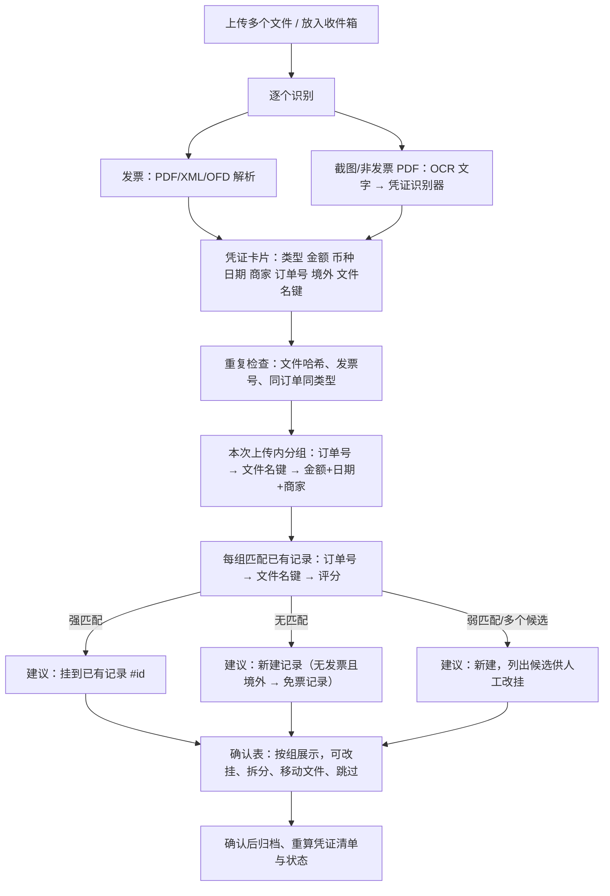

# 凭证识别与自动归并 · 设计 v2.1

编制日期：2026年9月17日　适用版本：在 v2.0 蓝图基础上增量实现

## 1 要解决的问题

| # | 用户场景 | 现状 |
| --- | --- | --- |
| 1 | 境外订阅（Claude Pro、ChatGPT、Windsurf）没有发票，只有 **订单/收据截图 + 银行交易截图**，也要作为一套报销凭证 | 非发票文件只能进“待归属”，无法识别内容，也无法单独成为记录 |
| 2 | 一笔支出的凭证分多次提供：先有发票后补支付截图，先有订单后补银行交易，或反之 | 只能进清单找到记录手动拖入；收集页上传的补充材料不会自动关联 |
| 3 | 同一套凭证同时上传（发票 + 交易订单截图；订单 + 银行交易；收据 + 账单 + 银行交易） | 每个文件各自处理，发票各建一条记录，截图全部进待归属 |

三个问题的共同核心：**识别每个文件“是什么、多少钱、哪天、哪家、哪个订单”，再把属于同一笔支出的文件归为一组，最后决定这组是挂到已有记录还是新建记录。**

## 2 整体流程



## 3 凭证识别

### 3.1 文字来源

| 文件 | 方式 |
| --- | --- |
| 发票 PDF / XML / OFD | 现有发票解析器（不变） |
| 其他 PDF（行程单、收据 PDF） | pdfplumber 文本层；无文本层时按图片 OCR |
| PNG / JPG / WEBP / HEIC 截图 | 本地 OCR（RapidOCR + onnxruntime，离线运行，不外传） |

OCR 作为可选依赖（`uv sync --extra ocr`，服务器部署脚本默认安装）；未安装时只依据文件名识别类型，金额等留空待人工填写。OCR 结果缓存到 `evidence_data.raw_text`，重新识别时复用。

### 3.2 凭证类型与识别器

每个识别器输入 OCR/PDF 文本行，输出 `RecognizedEvidence`，按特征词打分选择最匹配者。

| 识别器 | 特征 | 提取 |
| --- | --- | --- |
| 电商订单（京东/淘宝/拼多多/圆迈） | 订单编号、实付款、支付时间、下单时间、店铺名 | 订单号、实付金额（CNY）、支付日期、店铺、商品名、支付方式 |
| App Store 订阅订单 | 订单详细信息、订单号、订单日期、文稿编号、Apple 账户、US$ | 订单号、金额与币种（US$20.00）、订单日期、商品（Claude Pro - Monthly）、支付渠道（PayPal）、境外=是 |
| 境外收据/账单（Stripe 类英文收据：Windsurf、OpenAI 等） | Receipt / Invoice number / Amount paid / Date paid / Total | 收据号、金额与币种、日期、商家 |
| 银行卡交易明细 | 交易时间、交易卡号(末四位)、原始交易金额、原始交易币种、境内外交易标识、交易国家或地区、商户类别、入账 | 人民币金额、交易日期、商户描述（PP*APPLE.COM/BILL）、卡号末四位、原币金额与币种、境外=是/否 |
| 微信/支付宝账单详情 | 交易单号、商户单号、支付时间、收款方 | 交易号、金额、日期、收款方 |
| 打车行程单 PDF（滴滴/享道/高德） | 行程单、行程起止日期、合计、共 N 笔行程 | 合计金额、日期范围、平台 |
| 未识别 | — | 仅文件名推断类型 |

识别结果映射到附件类型：订单/收据/账单 → `order`，银行交易/微信支付宝账单 → `payment`，行程单 → `itinerary`。

### 3.3 文件名辅助

用户习惯命名（如 `办公-20260312-升降桌-459-江苏.pdf`、`办公-20260312-升降桌-交易订单.PNG`、`软件-Claude Pro-202606-订单.png`）包含大量线索：

- **类型词**：发票/电子发票、订单/交易订单、银行交易/交易记录/支付、收据、账单、行程单 → 附件类型
- **分类词**：首段 `办公`→办公用品、`软件`→软件服务、`打车`→差旅交通、`线缆`→易耗品、`图书`→（用户分类或其他）
- **文件名键**：去掉扩展名、类型词、金额（`459`、`46.80元`）、地区词（江苏、北京…）、空白与标点后的剩余部分。键相同且长度 ≥ 4 个有效字符，视为同一笔支出的线索。

## 4 数据模型变更

### 4.1 新表 `evidence_data`（非发票凭证的识别结果，1:1 附件）

| 字段 | 说明 |
| --- | --- |
| attachment_id | 主键，外键 attachment |
| doc_type | `order` / `receipt` / `payment` / `itinerary` / `unknown` |
| recognizer | 识别器名，如 `jd_order`、`app_store_order`、`bank_transaction`、`filename` |
| amount_cents | 票面金额（分，按 currency） |
| currency | ISO 币种，默认 `CNY` |
| cny_cents | 人民币金额（currency=CNY 时等于 amount_cents；银行交易为入账人民币；否则为空） |
| occurred_on | 支付/交易/订单日期 |
| merchant | 商家/店铺/商户描述 |
| item_name | 商品或订阅名称 |
| order_no | 订单号/收据号/交易号 |
| card_last4 | 卡号末四位 |
| is_foreign | 境外交易 |
| file_key | 文件名键 |
| raw_text | OCR/PDF 文本（截断 20000 字） |
| confirmed | 用户确认过 |

`invoice_data` 同样新增 `file_key`。

### 4.2 支出记录新增字段

| 字段 | 说明 |
| --- | --- |
| invoice_exempt | 免发票（境外消费等无法取得发票），默认 false |
| currency / original_amount_cents | 原币种与原币金额（如 USD 2000），`amount_cents` 始终为人民币报销金额 |

### 4.3 凭证清单与状态

- 默认规则调整（规则版本 3，按版本同步到已有库）：
  - 通用“发票”规则增加条件 `invoice_exempt: false`
  - 新增通用规则 `{invoice_exempt: true}`：订单/收据（必需）、支付记录（必需，提示“境外消费需附银行卡交易明细，显示人民币入账金额”）、情况说明（建议，提示“说明境外订阅用途与无法取得发票的原因”）
- 清单条件新增键 `invoice_exempt`。
- 状态推导：`has_invoice` 在免票记录中视为“已有订单/收据或支付记录任一项”，步进条第二步对免票记录显示为“已收凭证”。

## 5 分组与匹配

### 5.1 本次上传内分组（并查集）

按以下顺序在两个凭证之间建立“同组”连接，连接后两组合并；**每组最多一张发票**，合并会导致一组两张发票时放弃该连接。

| 优先级 | 连接条件 | 例 |
| --- | --- | --- |
| L1 | 订单号相同（忽略空格与大小写） | 发票备注“订单号:3434253000808809” ↔ 京东订单截图“订单编号 3434253000808809” |
| L2 | 文件名键相同 | `办公-20260312-升降桌-459-江苏.pdf` ↔ `办公-20260312-升降桌-交易订单.PNG` |
| L3 | 类型不同，人民币金额相等，日期相差 ≤ 3 天，且商家词有交集（或一方是无商家的支付记录） | 发票 ¥459 京东 ↔ 支付记录 ¥459 |
| L4 | 境外订单/收据（外币）↔ 境外银行交易（人民币），日期相差 ≤ 3 天，且平台兼容（Apple/PayPal↔App Store 订单；OpenAI↔ChatGPT 等），候选唯一 | Claude Pro US$20 6/28 ↔ 银行交易 PP*APPLE.COM ¥144.xx 6/28 |

### 5.2 与已有记录匹配（判断“是否首次上传”）

先做重复检查：文件哈希相同、发票号相同 → 重复跳过；**同一订单号的同类型凭证已在某记录中** → 标记“可能重复”，默认跳过但允许改为挂上。

然后对每组找目标记录（候选范围：未删除、非作废、不在已外发批次中的记录）：

| 顺序 | 规则 | 结果 |
| --- | --- | --- |
| M1 | 组内订单号与记录中任一发票/凭证订单号相同 | 强匹配，建议挂上 |
| M2 | 组内文件名键与记录中任一附件的文件名键相同 | 强匹配，建议挂上 |
| M3 | 评分：人民币金额相等 +40（境外：记录原币金额与订单原币金额相等 +40）；日期差 ≤ 3 天 +30、≤ 7 天 +15；商家/平台词交集 +20；记录凭证清单正好缺该组的类型 +10；记录已有同类型凭证 −30 | 最高分 ≥ 70 且领先第二名 ≥ 15 → 建议挂上；否则列前 5 名为候选 |
| — | 均无 | 建议新建 |

**建议新建时的字段来源**：发票 > 人民币支付记录 > 订单/收据。无发票且（境外或外币）→ `invoice_exempt=true`，`amount_cents` 取银行交易人民币金额（没有时留空待填），`currency/original_amount_cents` 取订单原币。分类：文件名首段分类词 → 现有分类建议逻辑。

### 5.3 自动确认（收件箱、待归属“生成记录”）

- 强匹配（M1/M2 或 M3 达阈值）→ 自动挂上
- 无匹配且有金额和日期 → 自动新建
- 其余留在待归属，并保存候选列表供人工处理

## 6 界面

### 6.1 收集页确认表（按组）

每组一行：

```text
┌──────────────────────────────────────────────────────────────────────────────┐
│ [发票 ▣] [订单 ▣]   2026-03-12 · 江苏京东海元贸易 · ¥459.00 · 订单 3434…8809   │
│ 关联依据：订单号一致                        操作：[新建记录 ▾]  分类 [办公用品▾] │
├──────────────────────────────────────────────────────────────────────────────┤
│ [订单 ▣] [银行交易 ▣]  2026-06-28 · Claude Pro - Monthly · US$20.00 / ¥144.26  │
│ 关联依据：文件名一致 · 境外免发票             操作：[挂到 #12 Claude Pro 5月 ▾]  │
└──────────────────────────────────────────────────────────────────────────────┘
```

- 文件以小卡片显示（缩略图 + 类型），卡片菜单：改类型、移到其他组、拆为单独一组。
- “操作”下拉：新建记录 / 挂到候选记录（显示匹配分与依据）/ 搜索其他记录 / 留在待归属。
- 显示“关联依据”，让用户知道为什么归为一组、为什么挂到这条记录。
- 重复与可能重复单独列出。

### 6.2 待归属

- 每个文件显示识别结果与“建议挂到 #id（依据）”，一键采纳；或“归属到…”手工选择。
- 批量“生成记录”使用同一分组逻辑。

### 6.3 清单页补传

- 清单表格每一行都是拖放目标：把文件拖到行上即上传到该记录（按识别结果自动判断类型），无需打开详情。
- 详情抽屉的凭证清单缺项行内拖放保留。
- 免票记录显示“免发票·境外”徽标，金额显示 `¥144.26（US$20.00）`。

## 7 接口变更（摘要，详见 api-contract.md）

- `Attachment.evidence: EvidenceData | null`（非发票识别结果）
- `ImportSession.groups: ImportGroup[]` 取代 `rows`：`{ group_id, attachments: Attachment[], link_reasons: string[], summary: {spent_on, amount_cents, currency, original_amount_cents, merchant, summary, category_id, is_online, invoice_exempt}, match: {expense_id, score, reasons[]} | null, candidates: Match[], suggested_action: create|attach|skip, warnings[] }`
- `POST /api/imports/{id}/confirm { groups: [{ group_id, attachment_ids, action, expense_id?, ...字段 }] }`
- `GET /api/attachments/{id}/candidates` → 候选记录列表（待归属人工关联）
- `POST /api/attachments/reparse` 同时重新识别非发票凭证
- `ExpenseDetail` 新增 `invoice_exempt, currency, original_amount_cents`；`PATCH /api/expenses/{id}` 可修改

## 8 验收用例

| 编号 | 场景 | 预期 |
| --- | --- | --- |
| V01 | 同时上传升降桌发票 PDF + 交易订单截图 | 一组，依据“订单号一致”，新建 1 条记录含发票与订单明细 |
| V02 | 同时上传 Claude Pro 6 月订单 + 银行交易 | 一组，免发票记录，金额取银行人民币，原币 US$20.00，清单齐全 |
| V03 | 只上传 ChatGPT 3 月银行交易 | 新建免发票记录，清单缺“订单/收据” |
| V04 | 之后再上传 ChatGPT 3 月订单 | 自动建议挂到 V03 的记录（文件名键或日期+平台），挂上后凭证齐全 |
| V05 | 先导入京东发票，后单独上传该订单截图 | 订单号匹配，自动建议挂上 |
| V06 | Windsurf 收据 + 账单 + 银行交易同时上传 | 一组三文件，免发票记录 |
| V07 | 同一订单截图再次上传（文件不同但订单号相同） | 标记可能重复，默认跳过 |
| V08 | 两笔金额相同、日期相近的不同京东订单同时上传（各有发票与订单截图） | 依订单号分为两组，不串组 |
| V09 | 打车电子发票 + 电子行程单 PDF | 一组，行程单归为 itinerary |
| V10 | 没安装 OCR | 截图按文件名识别类型并参与文件名键分组，金额留空待填，不报错 |
| V11 | 清单页把支付截图拖到某行 | 上传到该记录，类型识别为支付记录，清单与状态重算 |
